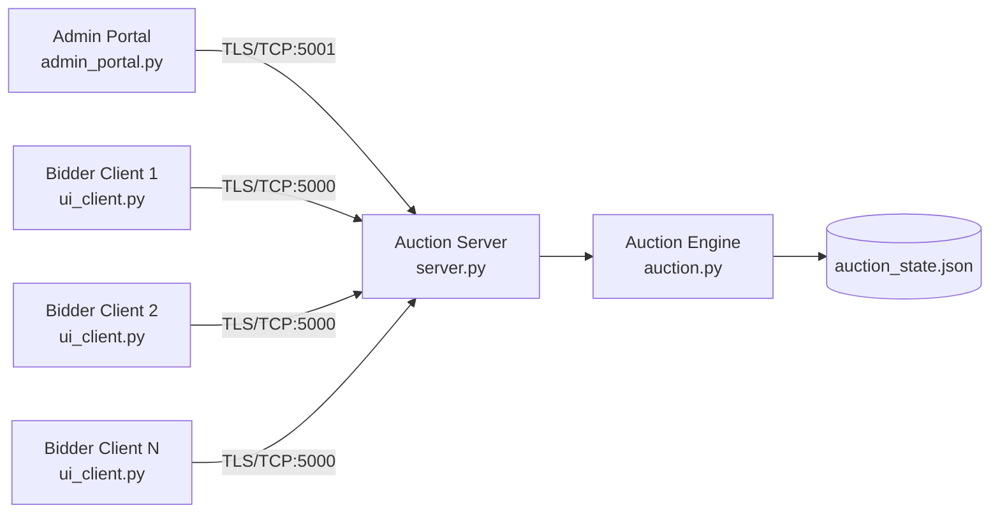

# System Architecture

## Problem Statement
Design a secure, concurrent online auction engine using low-level TCP sockets and SSL/TLS for all control and data communication.

## Components
- `server.py`: central coordinator; accepts bidder and admin TLS connections.
- `auction.py`: thread-safe auction state machine (bids, ties, escalation, anti-sniping, reputation, persistence).
- `ui_client.py`: bidder GUI client.
- `admin_portal.py`: admin GUI client.
- `auction_state.json`: persisted state.

## High-Level Architecture

## Communication Flow
1. Server starts TLS listeners on bidder port `5000` and admin port `5001`.
2. Bidder connects, receives `PREJOIN`, then sends `JOIN <username>`.
3. Admin sends `START` to activate auction.
4. Bidders send `BID <amount>` commands.
5. Server broadcasts `BID UPDATE` and state changes.
6. Tie at highest bid triggers escalation round.
7. Timer thread closes auction and broadcasts `AUCTION ENDED`.

## Protocol Summary
### Bidder Commands
- `JOIN <username>`
- `BID <amount>`
- `GET`
- `REPUTATION`
- `EXIT`

### Admin Commands
- `START <duration_seconds> <base_price> <escalation_seconds> [item_name]`
- `STOP`
- `STATUS`

### Server Events
- `PREJOIN|...`
- `JOINED|...`
- `BID UPDATE|...`
- `ESCALATION STARTED|...`
- `ESCALATION RESOLVED|...`
- `AUCTION ENDED|...`

## Concurrency Model
- Thread per connected bidder.
- Dedicated admin listener thread.
- Dedicated timer thread.
- Lock-protected shared structures (`clients`, `usernames`, auction state).

## Security Model
- TLS 1.2+ on both bidder and admin channels.
- Server cert/key loaded from `server.crt` and `server.key`.
- Clients trust pinned server certificate (`cafile=server.crt`).

## Fault Handling
- Invalid command and amount validation.
- Cleanup on abrupt disconnect.
- TLS handshake failure logging in server accept loops.
- Persistent state fallback if JSON loading fails.
